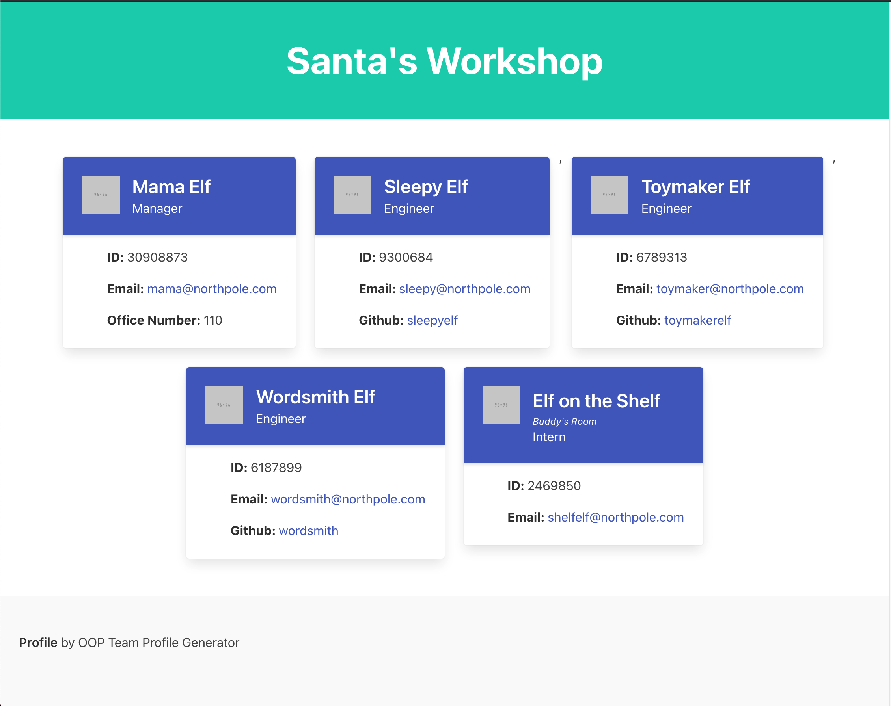

# Team Profile Generator

## Description: 
By running this little app in Command Line and answering a few questions, you can automatically generate a profile for your company's team.
    
## Table of Contents:
[Project Information](#team-profile-generator)<br />[Installation Instructions](#installation-instructions)<br />[Usage](#how-to-use)<br />[Preview](#preview)<br />[Technologies Used](#technologies-used)<br />[Website](#website)<br />[Tests](#testing)<br />[Questions](#questions)<br />[License](#license)<br />[Made By](#made-by)

## Built With the Following:
- JavaScript
 - HTML
 - ES6
 - Node
## Installation Instructions:
-  Download and install Node_js onto your computer.
 - Use the package manager Inquirer.
 - ```npm install inquirer```.
 - Download this project's zip file, and be sure to un-compress it.
 - Open the folder from Command Line.
 - Run ```node index```.
 - Answer the questions and voila! You have a new team profile.
## How to Use:
This app will prompt you to answer questions about your team to create an HTML site to easily access your team's information.  You’ll enter your team's name, add one employee at a time, their email address, and based on their role in the company, you will have the option to add information specific to that role. For example, selecting an engineer will guide you to add their Github username. At the end of it all, you’ll have a quality website uniquely rendered for the information you provide.
    
## Preview:
#### Click the image below to be directed to a video walkthrough of the app.
[](https://drive.google.com/file/d/1tZIwjHT40cYJkBeA_q7JphwCNCn7wtk9/view?usp=sharing)
    
## Packages and Third-Party Assets Used:
- Inquirer
- Jest
- Bulma CSS


## Website:
[https://github.com/itsmeadriana/OOP-team-profile-generator](#https://github.com/itsmeadriana/OOP-team-profile-generator)
## Testing:
- Download and install Jest_js onto your computer. 
- ```npm install --save-dev jest```. 
- Navigate to your team profile generator in Command Line.
- Run ```npm test```.
- This will run five unit tests.

Github: [github.com/itsmeadriana](github.com/itsmeadriana)


## License:
[Link](https://choosealicense.com/licenses/mit/)
### Made By:
© Copyright 2021 Adriana Nieves
